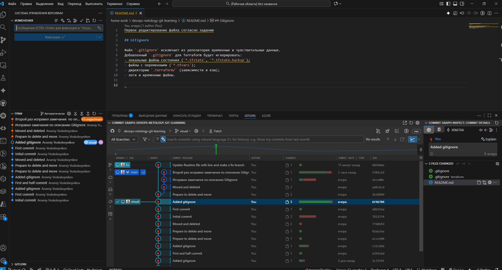

Первое редактирование файла согласно заданию

В каталоге `terraform/` используется собственный файл `.gitignore`, в котором заданы шаблоны для исключения файлов из отслеживания Git.  

Каждая строка описывает правило, определяющее, какие файлы или каталоги Git будет игнорировать:  

- `.terraform/` — пропускает весь каталог .terraform и всё его содержимое (символ / в конце указывает на каталог);  
- `*.tfstate` — пропускает все файлы, имена которых заканчиваются на .tfstate (символ * заменяет любую последовательность символов);  
- `*.tfstate.backup` — пропускает все файлы, оканчивающиеся на .tfstate.backup;  
- `*.tfvars` — пропускает все файлы с расширением .tfvars;  
- `*.tfvars.json` — пропускает все файлы с расширением .tfvars.json;  
- `override.tf` и `override.tf.json` — пропускают файлы с этими точными именами;  
- `*_override.tf` и `*_override.tf.json` — пропускают файлы, имена которых содержат шаблон _override перед расширением;  
- `crash.log` — пропускает файл с точным именем crash.log;  
- `crash.*.log` — пропускает все файлы, начинающиеся с crash., содержащие произвольные символы и заканчивающиеся на .log;
- `*.tfplan` — пропускает все файлы с расширением .tfplan;
- `*.terraformrc` — пропускает все файлы, оканчивающиеся на .terraformrc;
- `terraform.rc` — пропускает файл с точным именем terraform.rc.

4 задание выполнил в редакторе visual studio code. Он бесплатный и может тоже самое.
 